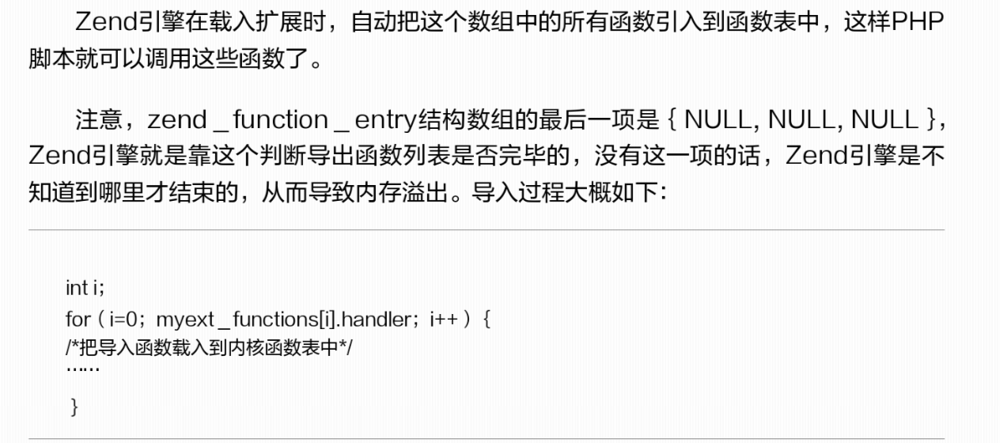

# 编写函数

> 上一篇：[静态编译](<2.4.md>)

**ZEND_FUNCTION()导出函数**

ZEND\_FUNCTION()宏函数数也可以写成PHP\_FUNCTION()，但ZEND\_FUNCTION()更前卫、标准一些，但两者是完全相同的。


**zend\_module\_entry**

zend\_module\_entry \<extension\_name\>\_module\_entry（它是联系C扩展与PHP语言的重要纽带）他的第三个参数需要是zend\_function\_entry[]类型的。


zend\_function\_entry在 zend/zend\_API.h中的定义:
```
typedef struct _zend_function_entry {
	const char *fname;
	zif_handler handler;
	const struct _zend_internal_arg_info *arg_info;
	uint32_t num_args;
	uint32_t flags;
} zend_function_entry;
```
zend\_function\_entry的参数：

{ NULL, NULL, NULL }



> 下一篇：[静态编译](<2.4.md>)